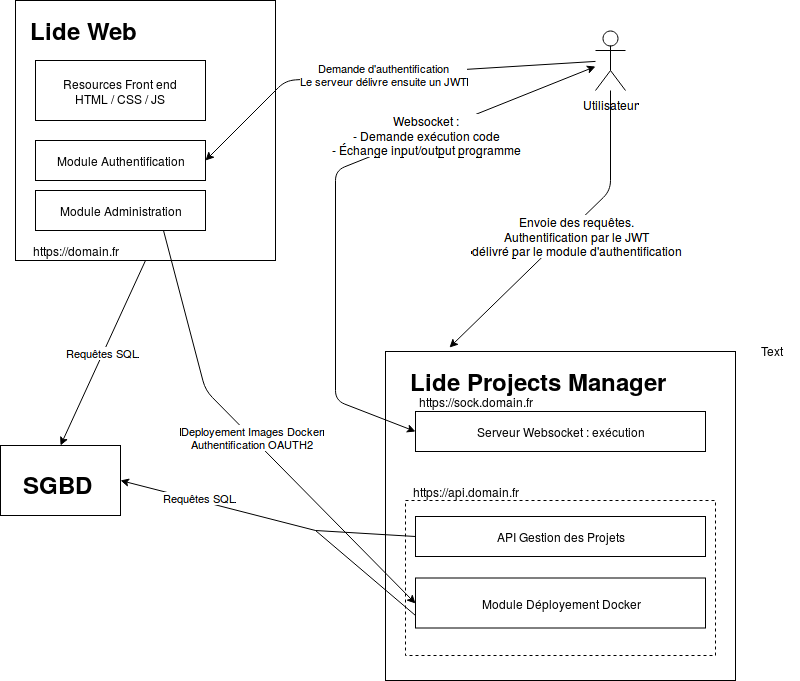

# Architecture

Le projet est divisée en deux applications distinctes :

* La [première application](#lide) (référée en tant que "application web" ou "serveur web" ou "lide") accueille toute la partie applicative :
  * Authentification des utilisateurs
  * Administration
  * Gestion de comptes
  * Mise à dispositions des assets web (html, css, js, images)
* La [seconde application](#project-manager-app) (référée en tant que "application métier" ou "Project Manager App" [PMA]) accueille la partie métier du site :
  * Gestion du code des utilisateurs : stockage des fichiers de code (avec l'API de gestion de projet)
  * Compilation et exécution du code via un serveur Websocket, qui gère la conteneurisation de cette exécution.
  * Module de déploiement automatisé des images Docker (lié à la partie administration de l'application web)

 L'authentification sur le serveur se fait au moyen de [Json Web Tokens (JWT)](https://jwt.io/), émis par l'application web. Plus de détail sont disponible dans la partie [authentification](/authentification/).

## Lide

TODO

## Project Manager App

TODO